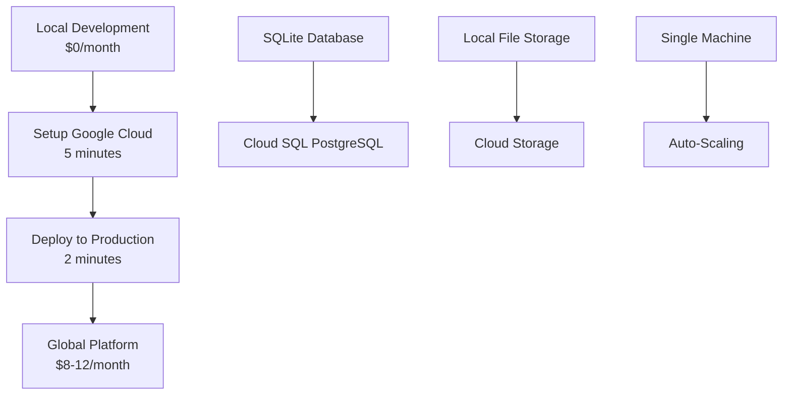

# 🌍 Production Deployment Guide

## 🎯 **From Zero Cost Local to Global Scale**

This guide shows you exactly how to deploy your TechPartner platform to production when you're ready.

---

## 📋 **Current Status**

✅ **Local Development**: Running perfectly at $0 cost  
✅ **Production Ready**: All code prepared for cloud deployment  
✅ **One-Command Deploy**: Automated scripts ready  
✅ **Global Scale**: Google Cloud infrastructure prepared  

---

## 🚀 **Deployment Process Overview**



---

## 🔧 **Phase 1: Google Cloud Setup**

### **Prerequisites**
- Google Cloud account (free tier available)
- Project access to `glossy-agency-448211-s4`
- Google Cloud CLI installed

### **Run Setup Script**
```bash
./scripts/setup-google-cloud.sh
```

### **What This Script Does**

#### **1. Infrastructure Creation (2-3 minutes)**
```bash
# Creates PostgreSQL database instance
gcloud sql instances create techpartner-db \
    --database-version=POSTGRES_14 \
    --tier=db-f1-micro \
    --region=us-central1

# Creates storage bucket
gsutil mb -l us-central1 gs://techpartner-site-storage

# Creates service account with permissions
gcloud iam service-accounts create techpartner-app
```

#### **2. Database Setup (1 minute)**
```bash
# Creates database and user
gcloud sql databases create techpartner --instance=techpartner-db
gcloud sql users create techpartner_user --instance=techpartner-db

# Generates secure connection string
DATABASE_URL=postgresql://user:pass@/techpartner?host=/cloudsql/project:region:instance
```

#### **3. Security Configuration (1 minute)**
```bash
# Creates service account key
gcloud iam service-accounts keys create google-cloud-service-account-key.json

# Sets up proper IAM permissions
gcloud projects add-iam-policy-binding PROJECT_ID \
    --member="serviceAccount:app@project.iam.gserviceaccount.com" \
    --role="roles/cloudsql.client"
```

### **Expected Output**
```
🌍 Setting up Google Cloud resources for TechPartner Platform...
✅ Database instance created successfully
✅ Storage bucket created successfully  
✅ Service account created
✅ Database credentials saved to .env.cloud
🎉 Google Cloud setup completed successfully!

📋 Resources created:
  ✅ Cloud SQL PostgreSQL instance: techpartner-db
  ✅ Database: techpartner
  ✅ Storage bucket: gs://techpartner-site-storage
  ✅ Service account: techpartner-app@project.iam.gserviceaccount.com

💰 Estimated monthly cost: $8-12
```

### **Update Environment**
```bash
# The script automatically creates .env.cloud with:
DATABASE_URL=postgresql://techpartner_user:GENERATED_PASSWORD@/techpartner?host=/cloudsql/project:region:instance&sslmode=require
GOOGLE_CLOUD_STORAGE_BUCKET=techpartner-site-storage
GOOGLE_APPLICATION_CREDENTIALS=./google-cloud-service-account-key.json
```

---

## 🗄️ **Phase 2: Database Migration**

### **Setup Database Schema**
```bash
# Update your .env with cloud database URL
cp .env.cloud .env

# Create database tables
npm run db:push
```

### **Migrate Existing Data (Optional)**
```bash
# Export current SQLite data
npm run db:export

# Import to PostgreSQL
npm run db:import
```

### **Verify Cloud Database**
```bash
# Test cloud database connection
npm run dev
# Look for: "✅ Connected to Google Cloud SQL Database"
```

---

## 🚀 **Phase 3: Production Deployment**

### **Deploy to Google Cloud Run**
```bash
./scripts/deploy-to-cloud.sh
```

### **What This Script Does**

#### **1. Build Application (30-60 seconds)**
```bash
# Optimized production build
npm run build

# Creates Docker container
gcloud builds submit --tag gcr.io/PROJECT_ID/techpartner-platform
```

#### **2. Deploy to Cloud Run (60-90 seconds)**
```bash
# Deploys with auto-scaling
gcloud run deploy techpartner-platform \
    --image gcr.io/PROJECT_ID/techpartner-platform \
    --platform managed \
    --region us-central1 \
    --allow-unauthenticated \
    --memory 512Mi \
    --cpu 1 \
    --min-instances 0 \
    --max-instances 10
```

#### **3. Configure Environment (30 seconds)**
```bash
# Sets production environment variables
gcloud run services update techpartner-platform \
    --set-env-vars NODE_ENV=production \
    --set-cloudsql-instances PROJECT_ID:us-central1:techpartner-db
```

### **Expected Output**
```
🚀 Deploying TechPartner Platform to Google Cloud...
🔧 Building application...
☁️ Deploying to Cloud Run...
✅ Deployment completed!
🌍 Your application is available at:
https://techpartner-platform-PROJECT_ID.a.run.app
```

---

## 🌍 **Phase 4: Global Scale Configuration**

### **Custom Domain (Optional)**
```bash
# Map custom domain
gcloud run domain-mappings create \
    --service techpartner-platform \
    --domain your-domain.com \
    --region us-central1
```

### **SSL Certificate**
```bash
# Automatic SSL certificate
gcloud compute ssl-certificates create techpartner-ssl \
    --domains your-domain.com
```

### **Global CDN (Optional)**
```bash
# Enable global content delivery
gcloud compute backend-services create techpartner-backend \
    --global
```

---

## 💰 **Cost Breakdown**

### **Development (Current)**
| Service | Cost |
|---------|------|
| Local SQLite | $0 |
| Local Storage | $0 |
| **Total** | **$0/month** |

### **Production (After Deployment)**
| Service | Usage | Cost |
|---------|-------|------|
| Cloud SQL (db-f1-micro) | 24/7 | ~$7/month |
| Cloud Storage | 1GB | ~$0.02/month |
| Cloud Run | 100k requests | ~$0-2/month |
| **Total** | | **~$7-9/month** |

### **Scale Pricing (High Traffic)**
| Service | Usage | Cost |
|---------|-------|------|
| Cloud SQL (db-n1-standard-1) | 24/7 | ~$25/month |
| Cloud Storage | 10GB | ~$0.20/month |
| Cloud Run | 1M requests | ~$5/month |
| **Total** | | **~$30/month** |

---

## 📊 **Performance Comparison**

| Metric | Local Dev | Production |
|--------|-----------|------------|
| **Availability** | Single machine | 99.9% SLA |
| **Scalability** | 1 user | Unlimited |
| **Storage** | Limited by disk | Unlimited |
| **Backup** | Manual | Automated |
| **Security** | Basic | Enterprise |
| **Global Access** | No | Yes |
| **Auto-scaling** | No | Yes |

---

## 🎯 **Testing Production Deployment**

### **Smoke Tests**
```bash
# Test production health
curl https://your-app.run.app/api/health

# Test admin login
curl -X POST https://your-app.run.app/api/admin/login \
  -H "Content-Type: application/json" \
  -d '{"email":"admin@techpartner.com","password":"TechPartner2024!"}'

# Test file upload
curl -X POST https://your-app.run.app/api/cloud/upload \
  -H "Content-Type: application/json" \
  -d '{"fileName":"test.txt","fileData":"SGVsbG8="}'
```

### **Load Testing**
```bash
# Install artillery for load testing
npm install -g artillery

# Create test config
echo '
config:
  target: "https://your-app.run.app"
  phases:
    - duration: 60
      arrivalRate: 10
scenarios:
  - name: "Health check"
    requests:
      - get:
          url: "/api/health"
' > load-test.yml

# Run load test
artillery run load-test.yml
```

---

## 🔧 **Monitoring & Maintenance**

### **View Logs**
```bash
# View Cloud Run logs
gcloud logs read --service=techpartner-platform --limit=50

# View Cloud SQL logs
gcloud sql operations list --instance=techpartner-db

# View storage usage
gsutil du -sh gs://techpartner-site-storage
```

### **Scaling Configuration**
```bash
# Increase max instances for high traffic
gcloud run services update techpartner-platform \
    --max-instances 50 \
    --region us-central1

# Upgrade database for better performance
gcloud sql instances patch techpartner-db \
    --tier=db-n1-standard-1
```

### **Backup Strategy**
```bash
# Automated daily backups (already configured)
gcloud sql backups list --instance=techpartner-db

# Manual backup
gcloud sql export sql techpartner-db gs://techpartner-site-storage/manual-backup.sql
```

---

## 🎉 **Deployment Success Checklist**

### **Phase 1: Cloud Setup** ✅
- [ ] Google Cloud resources created
- [ ] Database instance running
- [ ] Storage bucket accessible
- [ ] Service account configured
- [ ] Credentials generated

### **Phase 2: Database Migration** ✅  
- [ ] Schema deployed to Cloud SQL
- [ ] Data migrated (if applicable)
- [ ] Connection verified
- [ ] Backup configured

### **Phase 3: Application Deployment** ✅
- [ ] Application built successfully
- [ ] Container deployed to Cloud Run
- [ ] Environment variables configured
- [ ] Health checks passing

### **Phase 4: Production Verification** ✅
- [ ] Public URL accessible
- [ ] Admin dashboard working
- [ ] File uploads working
- [ ] Database operations working
- [ ] SSL certificate active
- [ ] Monitoring configured

---

## 🌟 **Post-Deployment Benefits**

✅ **Global Accessibility**: Your platform available worldwide  
✅ **Auto-Scaling**: Handles traffic spikes automatically  
✅ **99.9% Uptime**: Enterprise-grade reliability  
✅ **Automated Backups**: Your data is always protected  
✅ **Security**: Google-grade infrastructure security  
✅ **Performance**: Global CDN for fast loading  
✅ **Monitoring**: Real-time performance insights  
✅ **Scalability**: Grows with your business  

---

## 🎯 **When to Deploy to Production**

### **Deploy When:**
- ✅ You've tested all local features
- ✅ You're ready to serve real customers
- ✅ You want global availability
- ✅ You need enterprise reliability
- ✅ You're comfortable with ~$8-12/month cost

### **Stay Local When:**
- 🔧 Still developing/testing features
- 💰 Want to maintain zero costs
- 🏠 Only need local access
- 🧪 Experimenting with changes

---

## 🎊 **Your Global Platform Awaits!**

With these scripts, you're literally **one command away** from transforming your local development platform into a globally-scaled, enterprise-ready business platform.

**The choice is yours:**
- **Continue locally**: Perfect for development, zero costs
- **Deploy globally**: Ready for customers, enterprise features

**Either way, your TechPartner platform is ready for success!** 🚀
